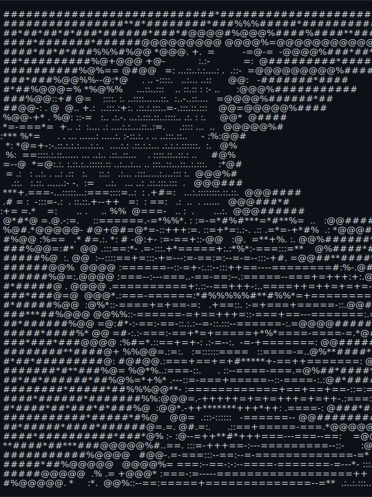

<div align="center">
<table>
<tr>
<td valign="middle" align="center">
<picture>
  <source media="(prefers-color-scheme: dark)" srcset="assets/ascii_art_dark.svg">
  <source media="(prefers-color-scheme: light)" srcset="assets/ascii_art_light.svg">
  
</picture>
</td>
<td valign="middle">

```text
<!--START_SECTION:terminal-->
naman@lodha
-----------
OS: ... macOS, Linux, Windows, iOS, Android
Uptime: ....... 19 years, 8 months, 22 days
Host: ......................... Naman Lodha
Kernel: .. CAM (Computer Aided Manufacturing) Operator
IDE: ... IntelliJ IDEA, VSCode, Antigravity

Languages.Programming: .. C, Python, JavaScript, Java
Languages.Computer: .. HTML, CSS, JSON, LaTeX, YAML
Languages.Real: ............ English, Hindi

- Contact -
Email: ............ namanlodha616@gmail.com
GitHub: .......................... naman616
LinkedIn: ..................... Naman Lodha
LeetCode: ......................... namanld

- GitHub Stats -
Repos: ................................. 27
Contributed: ........................... 21
Followers: .............................. 8
Stars: .................................. 0
Commits: .............................. 170
Lines of Code: .................. 1,337,492
<!--END_SECTION:terminal-->
```

</td>
</tr>
</table>
</div>
